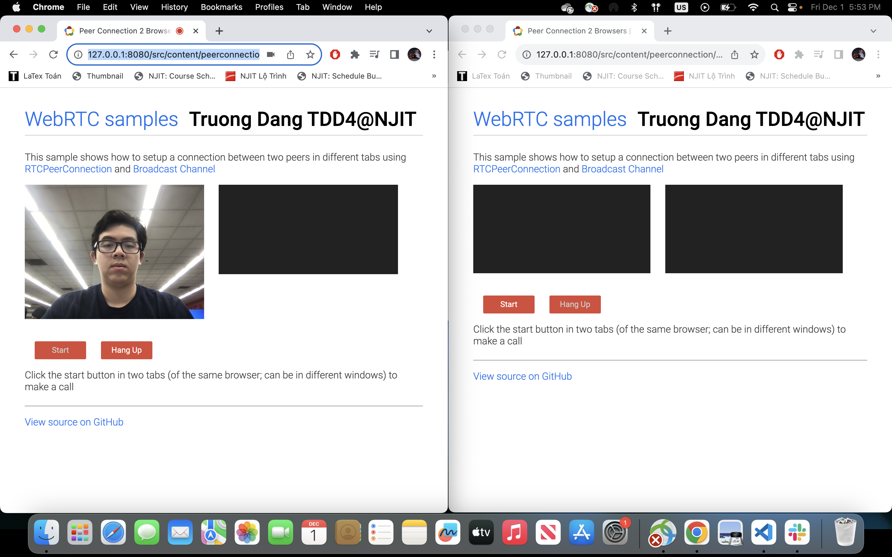
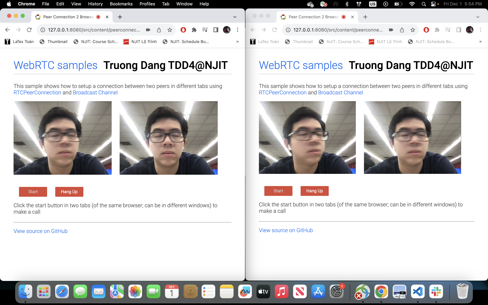

# Streaming Video using WebRTC by Truong Dang

This is a repository for the WebRTC JavaScript code samples. All of the samples can be tested from [webrtc.github.io/samples](https://webrtc.github.io/samples).

To run the samples locally
`
npm install && npm start
`
and open your browser on the page indicated.

## Peer-2-Peer Connection

### 1 peer joined

### 2 peers joined

Notice the lagging of the video. Because 2 peers are accessed via 2 browsers of the same device, the connection is good which lightens the lagging. Try to move fast and record your screen, you will see the lateness between 2 streams.

